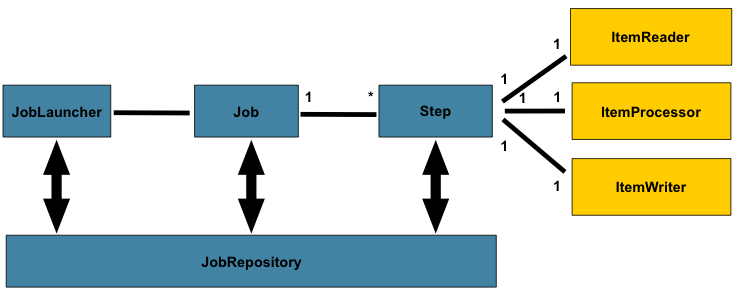

### Spring Batch ###
Spring Batch is a framework for batch processing – execution of a series of jobs without manual intervention

### Spring Batch Architecture ###


### Concept ###
1. Job : represents sequences of actions or commands that have to be executed within the batch application
2. Step :  A job consists of many steps and each step consists of a READ-PROCESS-WRITE(chunk) task or single operation task (tasklet)
   1. ItemReader :  read data from the resources (csv, xml or database)
   2. ItemProcessor :  provides a hook to apply business logic
   3. ItemWriter :  write it to other resources (csv, xml and database)
3. tasklet : means doing single task only, like clean up the resources after or before a step is started or completed
4. JobLauncher : responsible for starting a Job
5. Repositories : responsible of the storing and updating of metadata information related to Job instance executions and Job contexts

### How to start ###
1. create maven java project by following command <br>
`mvn archetype:generate -DgroupId=com.javaaround -DartifactId=SpringBatch -DarchetypeArtifactId=maven-archetype-quickstart -DinteractiveMode=false`

add dependency at pom.xml
```xml
<properties>
<springframework.version>4.0.6.RELEASE</springframework.version>
<springbatch.version>3.0.1.RELEASE</springbatch.version>
<junit.version>4.8.1</junit.version>
</properties>

<dependencies>
<dependency>
    <groupId>org.springframework</groupId>
    <artifactId>spring-core</artifactId>
    <version>${springframework.version}</version>
</dependency>
<dependency>
    <groupId>org.springframework</groupId>
    <artifactId>spring-oxm</artifactId>
    <version>${springframework.version}</version>
</dependency>
<dependency>
    <groupId>org.springframework.batch</groupId>
    <artifactId>spring-batch-core</artifactId>
    <version>${springbatch.version}</version>
</dependency>
<dependency>
    <groupId>org.springframework.batch</groupId>
    <artifactId>spring-batch-infrastructure</artifactId>
    <version>${springbatch.version}</version>
</dependency>
<dependency>
  <groupId>junit</groupId>
  <artifactId>junit</artifactId>
  <version>${junit.version}</version>
  <scope>test</scope>
</dependency>
```