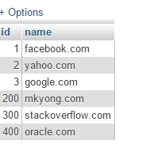
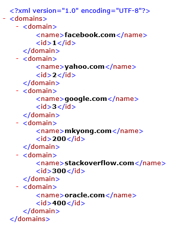

### Spring Batch ###
Spring Batch is a framework for batch processing – execution of a series of jobs without manual intervention

### Spring Batch Architecture ###


### Concept ###
1. Job : represents sequences of actions or commands that have to be executed within the batch application
2. Step :  A job consists of many steps and each step consists of a READ-PROCESS-WRITE(chunk) task or single operation task (tasklet)
   1. ItemReader :  providing the data from the resources (csv, xml or database) or custom.
   2. ItemProcessor :  provides a hook to apply business logic on each item
   3. ItemWriter :  write it to other resources (csv, xml and database)

```xml
<job id="helloWorldJob" xmlns="http://www.springframework.org/schema/batch">
  <step id="step1">
    <tasklet>
      <chunk reader="multiResourceReader" writer="flatFileItemWriter"
        commit-interval="1" />
    </tasklet>
  </step>
</job>
```

3. tasklet : means doing single task only(no input/output,only process), like clean up the resources after or before a step is started or completed
4. JobLauncher : responsible for starting a Job
5. Repositories : responsible of the storing and updating of metadata information related to Job instance executions and Job contexts

### How to start ###
1. create maven java project by following command <br>
`mvn archetype:generate -DgroupId=com.javaaround -DartifactId=SpringBatch -DarchetypeArtifactId=maven-archetype-quickstart -DinteractiveMode=false`

add dependency at pom.xml
```xml
<properties>
<springframework.version>4.0.6.RELEASE</springframework.version>
<springbatch.version>3.0.1.RELEASE</springbatch.version>
<junit.version>4.8.1</junit.version>
</properties>

<dependencies>
<dependency>
    <groupId>org.springframework</groupId>
    <artifactId>spring-core</artifactId>
    <version>${springframework.version}</version>
</dependency>
<dependency>
    <groupId>org.springframework.batch</groupId>
    <artifactId>spring-batch-core</artifactId>
    <version>${springbatch.version}</version>
</dependency>
<dependency>
    <groupId>org.springframework.batch</groupId>
    <artifactId>spring-batch-infrastructure</artifactId>
    <version>${springbatch.version}</version>
</dependency>
<dependency>
  <groupId>junit</groupId>
  <artifactId>junit</artifactId>
  <version>${junit.version}</version>
  <scope>test</scope>
</dependency>
```
### Input File ###

create inputs file [domain-1-3.csv]
```csv
1,facebook.com
2,yahoo.com
3,google.com
```

create domain-2-3.csv
```csv
1,facebook.com
2,yahoo.com
3,google.com
```

### Model of Input data ###

create Domain.java
```java
package com.javaaround;

public class Domain {

  int id;
  String domain;

  public int getId() {
    return id;
  }

  public void setId(int id) {
    this.id = id;
  }

  public String getDomain() {
    return domain;
  }

  public void setDomain(String domain) {
    this.domain = domain;
  }

}
```

create `application-context.xml` at resources/confiq where job launcher with job respository info
```xml
<beans xmlns="http://www.springframework.org/schema/beans"
  xmlns:xsi="http://www.w3.org/2001/XMLSchema-instance"
  xsi:schemaLocation="
    http://www.springframework.org/schema/beans 
    http://www.springframework.org/schema/beans/spring-beans-3.2.xsd">

  <!-- stored job-meta in memory -->

  <bean id="jobRepository"
    class="org.springframework.batch.core.repository.support.MapJobRepositoryFactoryBean">
    <property name="transactionManager" ref="transactionManager" />
  </bean>
  
  <bean id="transactionManager"
    class="org.springframework.batch.support.transaction.ResourcelessTransactionManager" />

  <bean id="jobLauncher"
    class="org.springframework.batch.core.launch.support.SimpleJobLauncher">
    <property name="jobRepository" ref="jobRepository" />
  </bean>

</beans>
```

create `batch-jobs.xml` at resources/jobs where where define each batch

```xml
<beans xmlns="http://www.springframework.org/schema/beans"
  xmlns:batch="http://www.springframework.org/schema/batch"
  xmlns:xsi="http://www.w3.org/2001/XMLSchema-instance"
  xsi:schemaLocation=
    "http://www.springframework.org/schema/batch
    http://www.springframework.org/schema/batch/spring-batch-2.2.xsd
    http://www.springframework.org/schema/beans
    http://www.springframework.org/schema/beans/spring-beans-3.2.xsd
  ">
  <import resource="../config/application-context.xml" />
  <bean id="domain" class="com.javaaround.Domain" />
  
  <job id="helloWorldJob" xmlns="http://www.springframework.org/schema/batch">
    <step id="step1">
      <tasklet>
        <chunk reader="multiResourceReader" writer="flatFileItemWriter"
          commit-interval="1" />
      </tasklet>
    </step>
    
  </job>

  <bean id="multiResourceReader"
    class=" org.springframework.batch.item.file.MultiResourceItemReader">
    <property name="resources" value="file:inputs/domain-*.csv" />
    <property name="delegate" ref="flatFileItemReader" />
  </bean>

  <bean id="flatFileItemReader" class="org.springframework.batch.item.file.FlatFileItemReader">

    <property name="lineMapper">
      <bean class="org.springframework.batch.item.file.mapping.DefaultLineMapper">

        <property name="lineTokenizer">
          <bean
            class="org.springframework.batch.item.file.transform.DelimitedLineTokenizer">
            <property name="names" value="id, domain" />
          </bean>
        </property>
        <property name="fieldSetMapper">
          <bean
            class="org.springframework.batch.item.file.mapping.BeanWrapperFieldSetMapper">
            <property name="prototypeBeanName" value="domain" />
          </bean>
        </property>
      </bean>
    </property>

  </bean>

  <bean id="flatFileItemWriter" class="org.springframework.batch.item.file.FlatFileItemWriter">

    <property name="resource" value="file:outputs/domain.all.csv" />
    <property name="appendAllowed" value="false" />
    <property name="lineAggregator">
      <bean
        class="org.springframework.batch.item.file.transform.DelimitedLineAggregator">
        <property name="delimiter" value="," />
        <property name="fieldExtractor">
          <bean
            class="org.springframework.batch.item.file.transform.BeanWrapperFieldExtractor">
            <property name="names" value="id, domain" />
          </bean>
        </property>
      </bean>
    </property>

  </bean>
</beans>  
```
### Package App ###
`mvn clean package`

### How to run ###

1. using `CommandLineJobRunner` class

  * by command prompt

  copy dependency jar first otherwise we can't get CommandLineJobRunner class

  ```xml
  <plugin>
      <groupId>org.apache.maven.plugins</groupId>
      <artifactId>maven-dependency-plugin</artifactId>
      <version>2.5.1</version>
      <executions>
        <execution>
        <id>copy-dependencies</id>
        <phase>package</phase>
        <goals>
          <goal>copy-dependencies</goal>
        </goals>
        <configuration>
          <outputDirectory>
            ${project.build.directory}/dependency-jars/
          </outputDirectory>
        </configuration>
        </execution>
      </executions>
    </plugin>
  ```

  `java CommandLineJobRunner config file job_name job_paramter'

  write below command project root directory 

  `java -cp "target/dependency-jars/*;target/springbatch.jar" org.springframework.batch.core.launch.support.CommandLineJobRunner spring/jobs/batch-jobs.xml helloWorldJob`

  above command can be done by following maven plugins

  ```xml
  <plugin>
      <groupId>org.codehaus.mojo</groupId>
      <artifactId>exec-maven-plugin</artifactId>
      <version>1.4.0</version>
      <executions>
          <execution>
            <id>my-execution</id>
            <!-- if skip phase: none -->
            <phase>package</phase>
            <goals>
              <goal>java</goal>
            </goals>
          </execution>
        </executions>
      <configuration>
         <mainClass>org.springframework.batch.core.launch.support.CommandLineJobRunner</mainClass>
          <arguments>
              <!-- job configuration file -->
              <argument>spring/jobs/batch-jobs.xml</argument>
              <!-- job name -->
              <argument>helloWorldJob</argument>
          </arguments>
      </configuration>
    </plugin>
  ```

  * by programming way 

  create App.java

  ```java
  package com.javaaround;
  import org.springframework.batch.core.Job;
  import org.springframework.batch.core.JobExecution;
  import org.springframework.batch.core.JobParameters;
  import org.springframework.batch.core.launch.JobLauncher;
  import org.springframework.context.ApplicationContext;
  import org.springframework.context.support.ClassPathXmlApplicationContext;
  import org.springframework.batch.core.launch.support.CommandLineJobRunner;
  /**
   * Hello world!
   *
   */
  public class App 
  {
      public static void main( String[] args )
      {
        try {

      CommandLineJobRunner.main(new String[] {
            "spring/jobs/batch-jobs.xml","helloWorldJob"
           });
      } catch (Exception e) {
        e.printStackTrace();
      }
           
      }
  }

  ```
2. using `JobLauncher` class

    update App.java
    ```java
    package com.javaaround;
    import org.springframework.batch.core.Job;
    import org.springframework.batch.core.JobExecution;
    import org.springframework.batch.core.JobParameters;
    import org.springframework.batch.core.launch.JobLauncher;
    import org.springframework.context.ApplicationContext;
    import org.springframework.context.support.ClassPathXmlApplicationContext;
    /**
     * Hello world!
     *
     */
    public class App 
    {
        public static void main( String[] args )
        {
            String[] springConfig  =
        {
          "spring/jobs/batch-jobs.xml"
        };

        ApplicationContext context =
          new ClassPathXmlApplicationContext(springConfig);

        JobLauncher jobLauncher = (JobLauncher) context.getBean("jobLauncher");
        Job job = (Job) context.getBean("helloWorldJob");
        try {

        JobExecution execution = jobLauncher.run(job, new JobParameters());
        System.out.println("Exit Status : " + execution.getStatus());

        } catch (Exception e) {
          e.printStackTrace();
        }
        }
    }

    ```

create AppTest.java
```java
package com.javaaround;

import org.junit.Test;

/**
 * Unit test for simple App.
 */
public class AppTest {
   @Test
   public void AppTest( ){
        App.main(null);
   }
}


```

### Run App ###
`mvn clean package`

### Output file ###
domain.all.csv
```csv
1,facebook.com
2,yahoo.com
3,google.com
200,mkyong.com
300,stackoverflow.com
400,oracle.com

```

if we run again we get error file already exits.for that we create tasklet that delete output file before execute step <br/>
update at batch-jobs.xml with `next` attribute

```xml
<step id="deleteDir"  next="step1">
    <tasklet ref="fileDeletingTasklet" />
</step>

<bean id="fileDeletingTasklet" class="com.javaaround.tasklet.FileDeletingTasklet" >
    <property name="directory" value="file:outputs/" />
  </bean>
```

create FileDeletingTasklet.java
```java
package com.javaaround.tasklet;

import java.io.File;

import org.springframework.batch.core.StepContribution;
import org.springframework.batch.core.UnexpectedJobExecutionException;
import org.springframework.batch.core.scope.context.ChunkContext;
import org.springframework.batch.core.step.tasklet.Tasklet;
import org.springframework.batch.repeat.RepeatStatus;
import org.springframework.beans.factory.InitializingBean;
import org.springframework.core.io.Resource;
import org.springframework.util.Assert;

public class FileDeletingTasklet implements Tasklet, InitializingBean {

  private Resource directory;

  @Override
  public void afterPropertiesSet() throws Exception {
    Assert.notNull(directory, "directory must be set");
  }

  @Override
  public RepeatStatus execute(StepContribution contribution, ChunkContext chunkContext) throws Exception {

    File dir = directory.getFile();
    Assert.state(dir.isDirectory());

    File[] files = dir.listFiles();
    for (int i = 0; i < files.length; i++) {
      boolean deleted = files[i].delete();
      if (!deleted) {
        throw new UnexpectedJobExecutionException("Could not delete file " + files[i].getPath());
      } else {
        System.out.println(files[i].getPath() + " is deleted!");
      }
    }
    return RepeatStatus.FINISHED;

  }

  public Resource getDirectory() {
    return directory;
  }

  public void setDirectory(Resource directory) {
    this.directory = directory;
  }

}
```

### Run App ###
`mvn clean package` <br/>
this time file already exists error gone!! because tasklet delete it first then step execute

### Complex type(Date) ###

update domain-1-3.csv
```csv
1,facebook.com,12/03/2016
2,yahoo.com,13/03/2016
3,google.com,14/03/2016
```

update domain-2-3.csv
```csv
200,mkyong.com,13/03/2016
300,stackoverflow.com,13/03/2016
400,oracle.com,13/03/2016
```
here we want work complex type instead primitive type then we need `fieldMapper`

create DomainFieldSetMapper.java

```java
package com.javaaround.fieldmapper;

import org.joda.time.LocalDate;
import org.springframework.batch.item.file.mapping.FieldSetMapper;
import org.springframework.batch.item.file.transform.FieldSet;
import org.springframework.validation.BindException;
 
import com.javaaround.Domain;
 
public class DomainFieldSetMapper implements FieldSetMapper<Domain>{
 
    @Override
    public Domain mapFieldSet(FieldSet fieldSet) throws BindException {
        Domain domain = new Domain();
        domain.setId(fieldSet.readInt(0));
        domain.setDomain(fieldSet.readString(1));
        domain.setCreatedDate(new LocalDate(fieldSet.readDate(2,"dd/MM/yyyy")));
        
        return domain;
    }
 
}
```

add dependency at pom.xml
```xml
 <dependency>
    <groupId>joda-time</groupId>
    <artifactId>joda-time</artifactId>
    <version>2.3</version>
</dependency>
```
update batch-jobs.xml
```xml
<!-- <bean
  class="org.springframework.batch.item.file.mapping.BeanWrapperFieldSetMapper">
  <property name="prototypeBeanName" value="domain" />
</bean> -->
 <bean class="com.javaaround.fieldmapper.DomainFieldSetMapper" />
```

update Domain.java
```java
package com.javaaround;
import com.javaaround.xmladapter.LocalDateAdapter;
import javax.xml.bind.annotation.XmlElement;
import javax.xml.bind.annotation.XmlRootElement;
import org.joda.time.LocalDate;
import javax.xml.bind.annotation.adapters.XmlJavaTypeAdapter;

@XmlRootElement
public class Domain {

  private int id;
  private String domain;
  private LocalDate createdDate;

  @XmlElement
  public int getId() {
    return id;
  }

  public void setId(int id) {
    this.id = id;
  }

  @XmlElement(name="create")
  @XmlJavaTypeAdapter(type = LocalDate.class, value=LocalDateAdapter.class)
  public LocalDate getCreatedDate() {
    return createdDate;
  }

  public void setCreatedDate(LocalDate createdDate) {
    this.createdDate = createdDate;
  }
  @XmlElement(name="name")
  public String getDomain() {
    return domain;
  }

  public void setDomain(String domain) {
    this.domain = domain;
  }

}
```

In JAXB2, complex data type like Date and BigDecimal, will not map to the field automatically, even it’s annotated.

To make JAXB2 supports Date conversion, you need to create a custom Adapter to handle the Date format manually, then attaches the adapter via @XmlJavaTypeAdapter

create LocalDateAdapter.java
```java
package com.javaaround.xmladapter;
import javax.xml.bind.annotation.adapters.XmlAdapter;
 
import org.joda.time.LocalDate;
 
public class LocalDateAdapter extends XmlAdapter<String, LocalDate>{
  @Override
    public LocalDate unmarshal(String v) throws Exception {
        return new LocalDate(v);
    }
  @Override
    public String marshal(LocalDate v) throws Exception {
        //default formate yyyy-MM-dd.if need other use
        // v.toString("dd/MM/yyyy")
        return v.toString();  
    }
 
}
```

### Write Into DB ###
update xmlns jdbc at application-context.xml

```xml
<beans 
  xmlns:jdbc="http://www.springframework.org/schema/jdbc"
  xsi:schemaLocation="
    http://www.springframework.org/schema/jdbc
    http://www.springframework.org/schema/jdbc/spring-jdbc-3.2.xsd
   ">
```

add DB info at application-context.xml

```xml
<!-- connect to database -->
    <bean id="dataSource"
    class="org.springframework.jdbc.datasource.DriverManagerDataSource">
    <property name="driverClassName" value="com.mysql.jdbc.Driver" />
    <property name="url" value="jdbc:mysql://localhost:3306/test" />
    <property name="username" value="root" />
    <property name="password" value="" />
    </bean>
   <!-- create job-meta tables automatically -->
    <jdbc:initialize-database data-source="dataSource">
    <jdbc:script location="org/springframework/batch/core/schema-drop-mysql.sql" />
    <jdbc:script location="org/springframework/batch/core/schema-mysql.sql" />
    </jdbc:initialize-database>
  <!-- stored job-meta in memory -->

  <!-- <bean id="jobRepository"
    class="org.springframework.batch.core.repository.support.MapJobRepositoryFactoryBean">
    <property name="transactionManager" ref="transactionManager" />
  </bean>
   -->

   <!-- stored job-meta in database -->
   
  <bean id="jobRepository"
    class="org.springframework.batch.core.repository.support.JobRepositoryFactoryBean">
    <property name="dataSource" ref="dataSource" />
    <property name="transactionManager" ref="transactionManager" />
    <property name="databaseType" value="mysql" />
  </bean>
```

add database writer at batch-jobs.xml
```xml
<bean id="mysqlItemWriter"
  class="org.springframework.batch.item.database.JdbcBatchItemWriter">
  <property name="dataSource" ref="dataSource" />
  <property name="sql">
    <value>
            <![CDATA[
              insert into domain(id,name) values (:id, :domain)
            ]]>
    </value>
  </property>
  <!-- It will take care matching between object property and sql name parameter -->
  <property name="itemSqlParameterSourceProvider">
    <bean
    class="org.springframework.batch.item.database.BeanPropertyItemSqlParameterSourceProvider" />
  </property>
  </bean>
```

### Run App ###
`mvn clean package` <br/>


### Write Into XML ###

add dependency at pom.xml
```xml
<dependency>
    <groupId>org.springframework</groupId>
    <artifactId>spring-oxm</artifactId>
    <version>${springframework.version}</version>
</dependency>
```

update Domain.java
```java
package com.javaaround;
import com.javaaround.xmladapter.LocalDateAdapter;
import javax.xml.bind.annotation.XmlElement;
import javax.xml.bind.annotation.XmlRootElement;
import org.joda.time.LocalDate;
import javax.xml.bind.annotation.adapters.XmlJavaTypeAdapter;

@XmlRootElement
public class Domain {

  private int id;
  private String domain;
  private LocalDate createdDate;

  @XmlElement
  public int getId() {
    return id;
  }

  public void setId(int id) {
    this.id = id;
  }

  @XmlElement(name="create")
  @XmlJavaTypeAdapter(type = LocalDate.class, value=LocalDateAdapter.class)
  public LocalDate getCreatedDate() {
    return createdDate;
  }

  public void setCreatedDate(LocalDate createdDate) {
    this.createdDate = createdDate;
  }
  @XmlElement(name="name")
  public String getDomain() {
    return domain;
  }

  public void setDomain(String domain) {
    this.domain = domain;
  }

}
```


add xml writer at batch-jobs.xml
```xml
 <bean id="xmlItemWriter" class="org.springframework.batch.item.xml.StaxEventItemWriter">
    <property name="resource" value="file:outputs/domain.xml" />
    <property name="rootTagName" value="domains" />
    <property name="marshaller">
        <bean class="org.springframework.oxm.jaxb.Jaxb2Marshaller">
            <property name="classesToBeBound">
                <list>
                    <value>com.javaaround.Domain</value>
                </list>
            </property>
        </bean>
    </property>
</bean>
```

### Run App ###
`mvn clean package` <br/>


### XML Reader ###

```xml
<bean id="xmlItemReader" class="org.springframework.batch.item.xml.StaxEventItemReader">
  <property name="fragmentRootElementName" value="domain" />
      <property name="resource" value="file:outputs/domain.xml" />
      <property name="unmarshaller">
          <bean class="org.springframework.oxm.jaxb.Jaxb2Marshaller">
              <property name="classesToBeBound">
                  <list>
                      <value>com.javaaround.Domain</value>
                  </list>
              </property>
          </bean>

      </property>

  </bean>
```

### DB Reader ###

```xml
<bean id="itemReader"
  class="org.springframework.batch.item.database.JdbcCursorItemReader"
  scope="step">
  <property name="dataSource" ref="dataSource" />
  <property name="sql"
    value="select id, name from domain" />
  <property name="rowMapper">
    <bean class="com.javaaround.rowmapper.DomainRowMapper" />
  </property>
</bean>
```
create DomainRowMapper.java

```java
package com.javaaround.rowmapper;
import com.javaaround.Domain;
import java.sql.ResultSet;
import java.sql.SQLException;
import org.springframework.jdbc.core.RowMapper;

public class DomainRowMapper implements RowMapper<Domain> {

  @Override
  public Domain mapRow(ResultSet rs, int rowNum) throws SQLException {
    Domain domain = new Domain();
    domain.setId(rs.getInt("id"));
    domain.setDomain(rs.getString("name"));
    return domain;
  }

}
```

### Job parameter ###

instead of hardcode param value like file path into batch config file we can use `job parameter`

update batch-jobs.xml with param
```xml
<bean id="multiResourceReader"
    class=" org.springframework.batch.item.file.MultiResourceItemReader" scope="step">
     <!--<property name="resources" value="file:inputs/domain-*.csv" />-->
    <property name="resources" value="#{jobParameters['filePath']}" />
    <property name="delegate" ref="flatFileItemReader" />
  </bean>
```

update App.java

```java
JobParameters jobParameters = new JobParametersBuilder()
    .addString("filePath", "file:inputs/domain-*.csv")
    .toJobParameters(); 
JobExecution execution = jobLauncher.run(job, jobParameters);

```

### Custom processor ###
Use case 

1. Input type transform to other type[like User -> employee]
   
  ```java
  //I == input type
  // O == Output type
  public interface ItemProcessor<I, O> {

    O process(I item) throws Exception;
  }
  ```

2. Filter out records thats should not write 

create DomainItemProcessor.java

```java
package com.javaaround.processor;

import org.springframework.batch.item.ItemProcessor;
import com.javaaround.Domain;
 
public class DomainItemProcessor implements ItemProcessor<Domain, Domain>{
 
    @Override
    public Domain process(Domain domain) throws Exception {
      
        /*
         * Only return results which are equal or more than 60%
         *
         */
        if(domain.getId() > 3){
            return null;
        }
 
        return domain;
    }
 
}
```

update batch-jobs.xml

```xml
<chunk reader="multiResourceReader" processor="domainItemProcessor" writer="xmlItemWriter"
          commit-interval="1" />
<bean id="domainItemProcessor" class="com.javaaround.processor.DomainItemProcessor" />
```

### Run App ###
`mvn clean package` <br/>

### Custom Reader ###
```java
public interface ItemReader<T> {

    T read() throws Exception, UnexpectedInputException, ParseException;

}
```

calling `read` on each item returns one Item or null if no more items are left. An item might represent a line in a file, a row in a database, an element in an XML file,hardcoded etc.

create DomainItemReader.java
```java
package com.javaaround.reader;

import java.util.List;

import org.springframework.batch.item.ItemReader;
import org.springframework.batch.item.ParseException;
import org.springframework.batch.item.UnexpectedInputException;
import com.javaaround.Domain;
/**
 * @author Dinesh Rajput
 *
 */
public class DomainItemReader implements ItemReader<Domain>{
 
 private List<Domain> domainList;
 private int domainCount = 0;
 @Override
 public Domain read() throws Exception, UnexpectedInputException,
   ParseException {
  
  if(domainCount < domainList.size())
    return domainList.get(domainCount++);
  else
    return null;
  
 }
 public List<Domain> getDomainList() {
  return domainList;
 }
 public void setDomainList(List<Domain> domainList) {
  this.domainList = domainList;
 }
 
}
```

update batch-jobs.xml

```xml
<chunk reader="domainItemReader" processor="domainItemProcessor" writer="xmlItemWriter"
          commit-interval="1" />
<bean id="domainItemReader" class="com.javaaround.reader.DomainItemReader"  >
    <property name="domainList" >
        <list>
            <bean class="com.javaaround.Domain">
      <property name="id" value="1" />
      <property name="domain" value="facebook.com" />
    </bean>
    <bean class="com.javaaround.Domain">
      <property name="id" value="2" />
      <property name="domain" value="yahoo.com" />
    
    </bean>
    
        </list>
    </property>
</bean>          
```

### Run App ###
`mvn clean package` <br/>

### Spring Listeners ###
 listeners help to listen into the Job or Step execution and intercept it.there are following listeners.

1. StepExecutionListener

  ```java
    public interface StepExecutionListener extends StepListener {
      void beforeStep(StepExecution stepExecution);
      ExitStatus afterStep(StepExecution stepExecution);
    }
  ```

2. ItemReadListener

  ```java
  public interface ItemReadListener extends StepListener {
    void beforeRead();
    void afterRead(T item);
    void onReadError(Exception ex);
  }
  ```

3. ItemProcessListener

  ```java
  public interface ItemProcessListener extends StepListener {
    void beforeProcess(T item);
    void afterProcess(T item, S result);
    void onProcessError(T item, Exception e);
  }
  ```

4. ItemWriteListener

  ```java
  public interface ItemWriteListener<S> extends StepListener {
    void beforeWrite(List items);
    void afterWrite(List items);
    void onWriteError(Exception exception, List items);
  }
  ```

5. ChunkListener

  ```java
  public interface ChunkListener extends StepListener {
    void beforeChunk();
    void afterChunk();
  }
  ```

6. SkipListener

  ```java
  public interface SkipListener extends StepListener {
    void onSkipInRead(Throwable t);
    void onSkipInProcess(T item, Throwable t);
    void onSkipInWrite(S item, Throwable t);
  }
  ```

7. JobExecutionListener

  ```java
  public interface JobExecutionListener extends StepListener {
    void beforeJob(TobExecution jobExecution);
    void afterJob(TobExecution jobExecution);
  }
  ```
